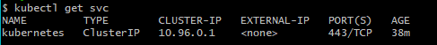
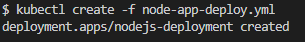
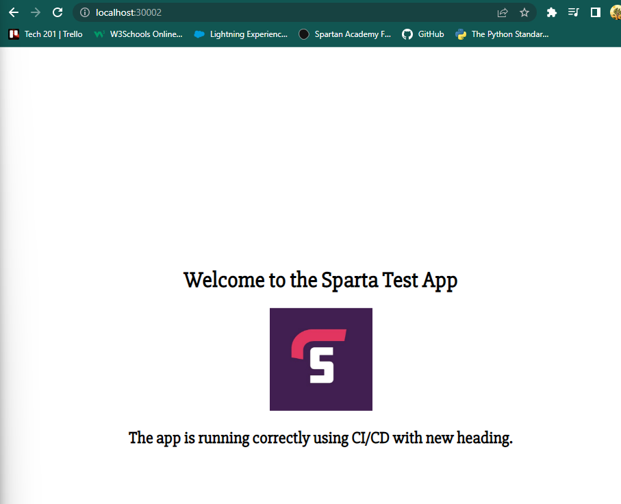
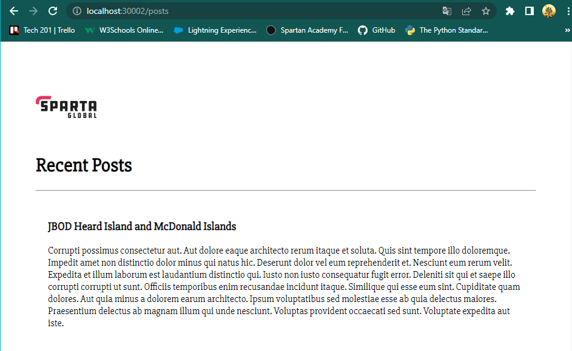
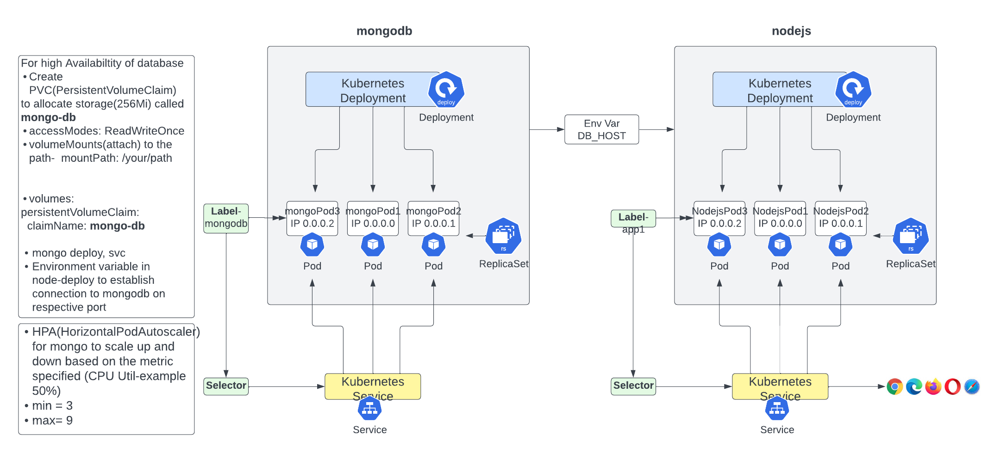

# Kubernetes (K8)


## Kubernetes set up

First things first, we will need to have docker desktop running.

We can open GitBash terminal as ADMIN and type `kubectl get service` our output should be something like this:

```Linux
$ kubectl get service
Unable to connect to the server: dial tcp [::1]:8080: connectex: No connection could be made because the target machine actively refused it.
```

To resolve this we need to open our Docker Desktop and go to settings. From there we click on "Kubernetes" and Enable Kubernetes. 


Lastly we need to click on "Apply& restart". This might take a while so please be patient. Once that is done, you might have to restart your machine. 

This is if the Kubernetes and Docker are running correctly. We can see this  green indicator on the bottom-left corner of Docker Desktop.


We can also check the successful instalation by using   `kubectl get svc` command in GitBash. 

This should be our output:




**NOTE**

To list out useful commands type `kubectl` in GitBash Terminal:

```
kubectl controls the Kubernetes cluster manager.

Find more information at: https://kubernetes.io/docs/reference/kubectl/

Basic Commands (Beginner):
 create          Create a resource from a file or from stdin
 expose          Take a replication controller, service, deployment or pod and expose it as a new Kubernetes service
 run             Run a particular image on the cluster
 set             Set specific features on objects

Basic Commands (Intermediate):
 explain         Get documentation for a resource
 get             Display one or many resources
 edit            Edit a resource on the server
 delete          Delete resources by file names, stdin, resources and names, or by resources and label selector

Deploy Commands:
 rollout         Manage the rollout of a resource
 scale           Set a new size for a deployment, replica set, or replication controller
 autoscale       Auto-scale a deployment, replica set, stateful set, or replication controller

Cluster Management Commands:
 certificate     Modify certificate resources.
 cluster-info    Display cluster information
 top             Display resource (CPU/memory) usage
 cordon          Mark node as unschedulable
 uncordon        Mark node as schedulable
 drain           Drain node in preparation for maintenance
 taint           Update the taints on one or more nodes

Troubleshooting and Debugging Commands:
 describe        Show details of a specific resource or group of resources
 logs            Print the logs for a container in a pod
 attach          Attach to a running container
 exec            Execute a command in a container
 port-forward    Forward one or more local ports to a pod
 proxy           Run a proxy to the Kubernetes API server
 cp              Copy files and directories to and from containers
 auth            Inspect authorization
 debug           Create debugging sessions for troubleshooting workloads and nodes

Advanced Commands:
 diff            Diff the live version against a would-be applied version
 apply           Apply a configuration to a resource by file name or stdin
 patch           Update fields of a resource
 replace         Replace a resource by file name or stdin
 wait            Experimental: Wait for a specific condition on one or many resources
 kustomize       Build a kustomization target from a directory or URL.

Settings Commands:
 label           Update the labels on a resource
 annotate        Update the annotations on a resource
 completion      Output shell completion code for the specified shell (bash, zsh, fish, or powershell)

Other Commands:
 alpha           Commands for features in alpha
 api-resources   Print the supported API resources on the server
 api-versions    Print the supported API versions on the server, in the form of "group/version"
 config          Modify kubeconfig files
 plugin          Provides utilities for interacting with plugins
 version         Print the client and server version information

Usage:
 kubectl [flags] [options]

Use "kubectl <command> --help" for more information about a given command.
Use "kubectl options" for a list of global command-line options (applies to all commands).

# To see all the services running in a cluset, run the following:

kubectl get svc

# The output will have the following format:
NAME         TYPE        CLUSTER-IP   EXTERNAL-IP   PORT(S)   AGE
```


---

## What is Kubernetes ?


Kubernetes is an open-source container orchestration platform that automates the
deployment, scaling, and management of containerized applications.

It allows developers to define how their application should run and it takes care of scheduling containers across a cluster of machines, ensuring that the containers are running and healthy, and scaling the application up or down as demand changes. 

## What are the benefits of K8?

1. Scalability: Kubernetes provides a scalable platform for deploying and managing containerized applications. It can automatically scale applications up or down based on demand, ensuring that the application is always available and responsive.

2. Flexibility: Kubernetes supports multiple container runtimes and can be deployed on a variety of infrastructure, including on-premises servers, public cloud, or hybrid environments.

3. Automation: Kubernetes automates the deployment, scaling, and management of containerized applications, reducing the need for manual intervention and increasing efficiency.

4. Community: Kubernetes has a large and active community of developers, users, and contributors, providing a wealth of resources, documentation, and support.

5. Resilience: Kubernetes provides self-healing capabilities that automatically recover from failures and ensure that applications are always available and responsive.


---

## K8 objects

Kubernetes uses objects to manage applications. The most commonly used objects include **Pod, Deployment, Service, ConfigMap, Secret, and Namespace**. 

These objects are defined using YAML or JSON manifests, which describes the desired state of the object, and Kubernetes uses these manifests to create, update, and delete objects in the cluster as necessary. 

---

## Kubernetes Architecture


Kubernetes architecture consists of a **master node and worker nodes.** 

The master node is responsible for managing the Kubernetes cluster and it's components, including the API server, etcd data store, scheduler, and controller manager. 

The worker nodes are responsible for running applications and workloads, represented by Pods. Each worker node runs a container runtime, such as Docker, and a kubelet agent that communicates with the master node to receive instructions on scheduling and managing Pods.

Communication between the master and worker nodes is achieved using the Kubernetes API, and communication between the Pods is achieved using a networking plugin, such as Calico or Flannel.

---

**1. API server:** It is the central management point for the cluster, which exposes the Kubernetes API and handles all communication with the Kubernetes objects.

---
**2. Controller Manager**: is a component of the control plane that run on the master node and manages various controllers that regulate tha state of the cluster. The Controller Manager ensures that the current state of the cluster mathces the desired state. 

---

**3. The scheduler**: is responsible for scheduling workloads on the worker nodes.

---


**4. etcd data store**: A distributed key-value store that stores all the configuration data of the Kubernetes cluster.

---

**5. Pod**: Th smallest and simplest unit in the Kubernetes object model, which represents a single instance of a running process in the cluster.

--- 
## Single-node cluster & multi-node cluster

**1. A single-node** is typically used for development and testing purposes, as it provides an easy and lightweight way to run and test Kubernetes workloads on a local machine. A single-node cluster includes all the components of a standard Kubernetes cluster, including the API server, etcd, kubelet, and kube-proxy, but they all run on a single host.

**2. A multi-node cluster** is used in production environments, where high availability and scalability are important. A multi-node cluster consists of **multiple nodes**, each running the Kubernetes components and hosting one or more Kubernetes workloads.
The nodes communicate with each other to maintain cluster state and ensure that workloads are scheduled and run correctly. 

### Summary

In summary, a single-node cluster is useful for testing and development, while a multi-node cluster is necessary for production workloads that require scalability, high availability, and fault tolerance.

---

## K8 Dependencies

There are several dependencies that must be installed on the host system to run a K8s cluster.

1. Container runtime: Kubernetes requires a container runtime, such as Docker

2. etcd: is a distributed key-value store used by Kubernetes to store it's data, including information about the cluster, nodes, pods, and services.

3. kubelet: kubelet is the primary node agent that runs on each worker node in a K8s cluster. It communicates with the control plane to ensure that the containers are running as expected. 

4. kubectl: kubectl is the command-line tool used to interact with a K8s cluster. It can be used to deploy and manage applications, view cluster status and logs, and perform other administrative tasks. 

5. Container Network Interface (CNI): Is a specification for network plugins used by K8s to connect containers within a pod and across different nodes in the cluster. 

**NOTE**

It's important to ensure that all the dependencies are compatible with each other and with the K8s version you are using. It's also recommended to follow the best practices for installing and configuring these dependencies to ensure a secure and stable K8s cluster.

--- 

# Deployment of Node App


### **Deployment and Service**

**A deployment in Kubernetes** is responsible for managing the deployment of a set of identical pods. It defines a desired state of the pod replicas and manages lifecycle of these pods. **Deployment ensuresthat the desired number of replicas of a pod is running**

**A service in Kubernetes** is a way to expose a set of pods as a network service. It **provides a stable network endpoint to access these pods.** 

---


1. For this task we will need to create a yaml file called `node-app-deploy.yml` where we write a script for deployment of the app. 

The script for `node-app-deploy.yml` file:

```YAML
apiVersion: apps/v1
kind: Deployment
metadata: 
  name: nodejs-deployment
spec:
  selector:
    matchLabels:
      app: nodejs-app
  replicas: 3
  template: 
    metadata: 
      labels: 
        app: nodejs-app
    spec:  
      containers:
      - name: nodejs-app
        image: marekmatyas/marek_tech201_node_app:latest
        ports: 
        - containerPort: 3000 
```
**NOTE**:
- `apiVersion`: Specifies the version of the Kubernetes API that this YAML file uses. In this case, `apps/v1` is used for deploying applications.
- `kind` : Specifies the type of Kubernetes object being created. In this case, it is a `Deployment` object.
- `replicas`: How many instances, in this case, 3.
- `labels`: The labels will be used in the next iteration for the service to communication.
- `image`: We will use the existing image for Node app from Docker Hub that we have previously created- `marekmatyas/marek_tech201_node_app:latest`
- `ports`- Specify the ports that we want to work on. 
 


2. Now we need to create another file in the same directory called `node-app-service.yml` to expose the app to the outside world. 

The script for `node-app-service.yml` file: 

```YAML
apiVersion: v1
kind: Service
metadata: 
  name: nodejs-app-svc
  namespace: default

spec: 
  ports: 
  - nodePort: 30002 
    port: 3000


    targetPort: 3000

  selector: 
    app: nodejs-app # this label connects this service to deployment

  type: NodePort
```

**NOTE**
- `port` defines the port on which the service is listening internally in the Kubernetes Cluster.
- `nodePort` defines a port on the nodes of the Kubernetes cluster, which can be used to access the service from outside the cluster. 

- Next we need to run our our VS code bash terminal `kubectl create -f node-app-deploy.yml`. This commands instructs `kubectl` to read the YAML file, interpret the contents, and create a Kubernetes deployment object based on the specified configuration.



- Lastly we need to run `kubectl create -f node-app-service.yml` command.

Now we should have our app deployed and running. To check the functionality we type in the browswe `localhost`+ `nodePort`, in this case 30002.


---

## Deployment of Mongodb database and Nodejs as microservice K8

Now for this task we will need to create additional files and the order that we run them in is very important. 

- `mongodb-deploy.yml`
- `mongodb-service.yml`
- `node-app-deploy.yml`
- `node-app-service.yml`

Let's have a look at the each file in more detail:

1. `mongo deployment`

```YAML
---
apiVersion: apps/v1
kind: Deployment
metadata:
  name: mongo
spec:
  selector:
    matchLabels:
      app: mongo
  replicas: 1
  template:
    metadata:
      labels:
        app: mongo
    spec:
      containers:
        - name: mongo
          image: mongo:3.2.20
          ports:
          - containerPort: 27017
``` 
Just like previously, we need to specify the `kind` of the object we want to create -> `Deployment`. Appropriate name, label, number of instances, image we want to work with, and port. 

---

2. `mongo service`

```YAML
---
apiVersion: v1
kind: Service
metadata: 
  name: mongo

spec: 
  selector: 
    app: mongo
  ports: 
    - port: 27017
      targetPort: 27017
```

In this file we specify the `apiVersion`, kind of the object -> `Service`, name, label, and the port. 

---

3. `node deploy`

```YAML
---
apiVersion: apps/v1 #which Api to use for deployment
kind: Deployment # what kind of API/object you want to create
metadata: 
  name: nodejs-deployment # name for the deployment
spec:
  selector:
    matchLabels:
      app: node-app 

  replicas: 3 # How many replicas/instances 
  template: 
    metadata: 
      labels: 
        app: node-app # This label connects to the service or any other K8 components
    # Lets define the container spec
    spec:  
      containers:
      - name: node-app
        image: marekmatyas/marek_tech201_node_app:latest
        ports: 
        - containerPort: 3000
        env:
        -  name: DB_HOST
           value: mongodb://mongo:27017/posts
        lifecycle: 
          postStart:
            exec: 
              command: ["node", "seeds/seed.js"]
```
In this file for `node deployment` we need to specify the image we want to be working with. In this case I used `marekmatyas/marek_tech201_node_app:latest` which is my own working image from Docker Hub for app deployment. 
To establish the connection between node and mongo, we need to configure the **Environment Variable** called `DB_HOST`. 


The code below specifies to run certain processes after the deployment, which is to populate/"seed" the database. 
```YAML
lifecycle: 
          postStart:
            exec: 
              command: ["node", "seeds/seed.js"]
```

---

4. `node service`

```YAML
---

apiVersion: v1
kind: Service
metadata: 
  name: nodejs-app-svc
  namespace: default

spec: 
  ports: 
  - nodePort: 30002 #range is 30000- 32768
    port: 3000


    targetPort: 3000

  selector: 
    app: node-app # this label connects this service to deployment

  type: NodePort
```

And lastly this is our `node-app-service.yml` file. We need to ensure that the labels for Service and Deployment file are correct. 

**NOTE**
- `port` defines the port on which the service is listening internally in the Kubernetes Cluster.
- `nodePort` defines a port on the nodes of the Kubernetes cluster, which can be used to access the service from outside the cluster.

---

Now that all `.yml` files are configured we need to run them in a certain order. 

- `kubectl create -f mongodb-deploy.yml`
- `kubectl create -f mongodb-service.yml`
To check if these commands were succesfull we can use `kubectl get deploy` and `kubectl get svc` to display the deployment and services are created and running.

- `kubectl create -f node-app-deploy.yml`
- `kubectl create -f node-app-service.yml`

Use the same commands as before to display the succesfull process using `kubectl get deploy` and `kubectl get svc`.

Additionally, we can check if the pods are also running correctly using `kubectl get pods` command. 

If all the steps above were succesfull, we should be able to see the app displayed with the posts: 



---

## Implementation of Autoscaler and PVC(PersistentVolumeClaim) for High Availability




