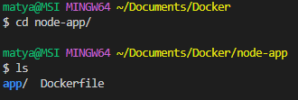

# Containerisation-and-Microservices--Docker-K8

Let's dive into working with Docker. 

Fist we will need to install Docker using this simple guide for Windows 11 -> [Docker install guide](https://www.youtube.com/watch?v=AAWNQ2wDVAg). We will be prompted a couple times to restart our laptop for the changes to take effect. 

When everything is up to date we can open GitBash terminal as ADMIN and run `docker --version`: `Docker version 20.10.23, build 7155243
`

Another test of functionality we can run is by using this command `docker run hello-world`. 

The output should as follows: 

[](pictures/hello.png)


We also need to create a Docker Hub -> [Docker Hub](https://hub.docker.com/) account for finding and sharing container images and we will need to sync it with our Docker desktop. 

---

## What is Docker ?

Docker is a popular platform used for creating, deploying, and running applications inside containers. Containers provide an isolated environment for running applications, allowing them to run consistently across different machines, operating systems, and cloud environments.

---

# Why do we use it ? 

1. Portability: Docker containers are highly portable, meaning they can be run consistently across different machines, operating systems, and cloud environments. This allows developers to easily deploy and scale applications without worrying about compatibility issues.

2. Efficiency: Docker allows developers to package an application and all of its dependencies into a single container image, making it easy to deploy the same application to multiple environments without having to worry about installation and configuration.

3. Isolation: Docker containers provide an isolated environment for running applications, which can help to improve security and stability by preventing conflicts between different applications or system components.

4. Speed: Docker containers are lightweight and can be started and stopped quickly, making them ideal for rapidly deploying and scaling applications.

---

# How is it used ? 

1. Create a Dockerfile - this is a configuration file that defines the application and its dependencies.

2. Build a Docker image - use the Dockerfile to build a Docker image, which is a package that contains the application and all of its dependencies.

3. Store the Docker image - store the Docker image in a Docker registry, such as Docker Hub or a private registry.

4. Start a Docker container - use the docker run command to start a new Docker container based on the Docker image.

5. Interact with the application - interact with the application running inside the container, just as you would if it were running on the host machine.

6. Manage the container - use Docker commands to manage the container, such as stopping it, restarting it...

---

### Who is using Docker ? 

Docker is used by developers, IT operations, DevOps teams, enterprises, and cloud providers to simplify the process of deploying and managing applications in a consistent and portable manner.

---

# Benefits of using Docker

- Portability: Containers can run on any infrastructure that supports Docker.

- Consistency: Containers provide a consistent environment, ensuring that applications run the same way everywhere.

- Efficiency: Containers are lightweight and require fewer resources than virtual machines.

- Scalability: Containers can be easily scaled up or down as needed.

- Security: Containers provide isolation and can be configured with security features.

---

### Difference between Virtualization VS Containerization

Virtualization and containerization are two different technologies used for running applications in isolated environments.

Overall, while virtualization provides better isolation, containerization is more efficient and lightweight, making it a popular choice for modern application deployment.

--- 

#  Docker architecture and API

Docker is built on a client-server architecture that consists of three main components:

1. Docker daemon: It is the server-side component that manages Docker objects such as images, containers, networks, and volumes.

2. Docker client: It is the command-line interface (CLI) used to interact with the Docker daemon. The client sends commands to the daemon, which executes them and returns the results.

3. Docker registry: It is a centralized repository for storing Docker images. Docker Hub is the default public registry for storing and sharing Docker images, while private registries can also be used.

Docker also provides a RESTful API that allows developers to programmatically interact with Docker. The API can be used to manage Docker objects, such as images, containers, networks, and volumes, and perform various operations, such as creating, starting, stopping, and deleting Docker objects.

The Docker API supports multiple programming languages and is widely used by DevOps teams and developers to automate the deployment and management of Docker containers.


---

**If we wish to list out all the commands we can use `docker`command in the terminal**:

```
$ docker

Usage:  docker [OPTIONS] COMMAND

A self-sufficient runtime for containers

Options:
      --config string      Location of client config files (default
                           "C:\\Users\\matya\\.docker")
  -c, --context string     Name of the context to use to connect to the
                           daemon (overrides DOCKER_HOST env var and
                           default context set with "docker context use")
  -D, --debug              Enable debug mode
  -H, --host list          Daemon socket(s) to connect to
  -l, --log-level string   Set the logging level
                           ("debug"|"info"|"warn"|"error"|"fatal")
                           (default "info")
      --tls                Use TLS; implied by --tlsverify
      --tlscacert string   Trust certs signed only by this CA (default
                           "C:\\Users\\matya\\.docker\\ca.pem")
      --tlscert string     Path to TLS certificate file (default
                           "C:\\Users\\matya\\.docker\\cert.pem")
      --tlskey string      Path to TLS key file (default
                           "C:\\Users\\matya\\.docker\\key.pem")
      --tlsverify          Use TLS and verify the remote
  -v, --version            Print version information and quit

Management Commands:
  builder     Manage builds
  buildx*     Docker Buildx (Docker Inc., v0.10.3)
  compose*    Docker Compose (Docker Inc., v2.15.1)
  config      Manage Docker configs
  container   Manage containers
  context     Manage contexts
  dev*        Docker Dev Environments (Docker Inc., v0.1.0)
  extension*  Manages Docker extensions (Docker Inc., v0.2.18)
  image       Manage images
  manifest    Manage Docker image manifests and manifest lists
  network     Manage networks
  node        Manage Swarm nodes
  plugin      Manage plugins
  sbom*       View the packaged-based Software Bill Of Materials (SBOM) for an image (Anchore Inc., 0.6.0)
  scan*       Docker Scan (Docker Inc., v0.25.0)
  scout*      Command line tool for Docker Scout (Docker Inc., v0.6.0)
  secret      Manage Docker secrets
  service     Manage services
  stack       Manage Docker stacks
  swarm       Manage Swarm
  system      Manage Docker
  trust       Manage trust on Docker images
  volume      Manage volumes

Commands:
  attach      Attach local standard input, output, and error streams to a running container
  build       Build an image from a Dockerfile
  commit      Create a new image from a container's changes
  cp          Copy files/folders between a container and the local filesystem
  create      Create a new container
  diff        Inspect changes to files or directories on a container's filesystem      
  events      Get real time events from the server
  exec        Run a command in a running container
  export      Export a container's filesystem as a tar archive
  history     Show the history of an image
  images      List images
  import      Import the contents from a tarball to create a filesystem image
  info        Display system-wide information
  inspect     Return low-level information on Docker objects
  kill        Kill one or more running containers
  load        Load an image from a tar archive or STDIN
  login       Log in to a Docker registry
  logout      Log out from a Docker registry
  logs        Fetch the logs of a container
  pause       Pause all processes within one or more containers
  port        List port mappings or a specific mapping for the container
  ps          List containers
  pull        Pull an image or a repository from a registry
  push        Push an image or a repository to a registry
  rename      Rename a container
  restart     Restart one or more containers
  rm          Remove one or more containers
  rmi         Remove one or more images
  run         Run a command in a new container
  save        Save one or more images to a tar archive (streamed to STDOUT by default) 
  search      Search the Docker Hub for images
  start       Start one or more stopped containers
  stats       Display a live stream of container(s) resource usage statistics
  stop        Stop one or more running containers
  tag         Create a tag TARGET_IMAGE that refers to SOURCE_IMAGE
  top         Display the running processes of a container
  unpause     Unpause all processes within one or more containers
  update      Update configuration of one or more containers
  version     Show the Docker version information
  wait        Block until one or more containers stop, then print their exit codes     

Run 'docker COMMAND --help' for more information on a command.

To get more help with docker, check out our guides at https://docs.docker.com/go/guides

```
--- 

## Step guides

Let's open a GitBash terminal as admin and run this command:

- `docker run -d -p 80:80 nginx` this command will start a new container running NGINX and make it available to port 80(host machine:container port)

- `docker ps` to list out all the details and ID's

- To enter the container we use `docker exe -it "CONTAINER ID" sh` this command will start the interactive shell
- `apt update -y`
- `apt upgrade -y`
- ` apt install nano` to install the editor
- Navigate into this location `cd /usr/share/nginx/html` and use `nano index.html` to edit the index.html file

- For test puposes change the heading 1 and save it using `ctrl+x->y->Enter`

- Then we exit the interactive shell using `exit`


Once we are in the local host we need to save the changes.

For that we will need to use "commit" command just like so:

` docker commit e651fda3edbc marek_nginx_testpage`:

- `docker commit` is to create a new Docker Image based on the containers changes
- `e651fda3edbc` this is the ID or a name of the container that we want to create the image from
- `marek_nginx_testpage` lastly this is the name of the image we are trying to create.

Next we need to create a tag for this image in order to `push`

`docker tag marek_nginx_testpage marekmatyas/marek_tech201_nginx:marek_nginx_tag`:

- `marek_nginx_testpage` this is the name of the image that we want to tag.
- `marekmatyas/marek_tech201_nginx` Here we can specify the username for our Docker Hub and name of the Docker Hub repository we want to strore the image in.
- `marek_nginx_tag` Lastly this is the name of the tag that we want to assign to the image. 

Lastly, we can push this changes just like so:

Using this command `docker push marekmatyas/marek_tech201_nginx:marek_nginx_tag`:

- `marekmatyas/marek_tech201_nginx` This is the user name of our Docker Hub account and the name of the Docker Hub repo

- `marek_nginx_tag` this is the name of the tag that we assign to the image. 

Then we can check the Docker Hub repositories if it has been created and type "localhost" in the browser if the changes are displayed. 

---

### Now we can automate this procces so we don't need to manually enter the container

Next we create a new folder localy called "Docker". 

Open a new VS code window and navigate into that folder. 

There we will need to create an html file called `index.html` in that directory and write a simple html script. 

```html
<html>
    <head>
        <title>Welcome to Shahrukh's website</title>
    </head>
    <body>
        <h1>Welcome to Mareks Website</h1>
        <h2>This website is hosted inside a container using docker to build a Micro-Service</h2>
    </body>
</html>
```

This is the content that we want to display after we automate everything using `Dockerfile`.

Let's create a `Dockerfile` with no extension in the same directory.


This is where we write the followin script:

```
# Select base image
FROM nginx 

# Label it
LABEL MAINTAINER=MMatyas@sparta

# Copy data from local host to the container
COPY index.html /usr/share/nginx/html/

#Allow required port
EXPOSE 80

# Execute required command

CMD ["nginx", "-g", "daemon off;"]
```

- `FROM nginx`: This instruction specifies the base image to use for the new image. In this case, we're using the official nginx image as the base.
- `LABEL MAINTAINER=MMatyas@sparta`: This instruction adds a label to the image, specifying the image maintainer's name and email address.
- `COPY index.html /usr/share/nginx/html/`: This instruction copies the index.html file from the Docker build context to the /usr/share/nginx/html/ directory inside the container.

- `EXPOSE 80`: This instruction informs Docker that the container will listen on port 80 at runtime

- `CMD ["nginx", "-g", "daemon off;"]`:  This instruction specifies the default command to execute when the container is started. In this case, it starts the Nginx web server and runs it in the foreground using the daemon off option. This will keep the container running until it's stopped explicitly or terminated by the user.

Then inside our VS code bash terminal we run these commands:

- `docker build -t marekmatyas/tech201-nginx:v1 .`:  this command will build a new Docker image based on the instructions in the Dockerfile in the current directory, and tag it with the name `marekmatyas/tech201-nginx:v1`

- `docker run -d -p 80:80 marekmatyas/tech201-nginx:v1`: this command will create and start a new Docker container based on the `marekmatyas/tech201-nginx:v1` image, mapping port `80` to the host machine and running the container in the background.

---

**Possible blocker**: If you receive the following error, this means that the port is already engaged. There are multiple ways of resolving this. We can use a different port when using `docker run` or there is more suitable option of removing the previous containers that are using this port if the containers are not needed anymore 

To delete containers:

- `docker ps` to list out the details and IDs'

- `docker rm "CONTAINER ID" -f` to delete that specific container

---

Lastly we can use `docker push` command to push the docker image to a Docker Hub. This command might require the authentication with the remote registry using `docker login`. 

- `docker push marekmatyas/tech201-nginx:v1` Once the push is comlete, the `marekmatyas/tech201-nginx:v1` image will be available for others to pull and run on their own machine using `docker pull` and `docker run`. After this we should be able to see the service in our browser by typing `localhost`. **NOTE**- if you had to use different ports for the container we use `localhost:PORT_NUM`. 


**USEFUL NOTE**: If we ever experience connectivity trouble, to prevent any issues we can use this command `docker run -d -p 4000:4000 docs/docker.github.io` which contains the documentation of Docker which can be accessed while offline. It will download all the neccessary documentation packages and can be accessed by typing `localhost:4000` in our browser search bar.


# Deployment of our node APP

First things first we need to clarify an importand fact. We can have only one `Dockerfile` in the same directory but if we would like to create another one it has to be in subdirectory so we will need to create a folder within the main directory where we create another `Dockerfile` just like so:


Next step is to manually copy our `app` folder that contains all the scripts for the app. We do that by locating the app folder locally, copying the file, and pasting it in the `node-app` folder where the second `Dockerfile` is located as we can see in the picture above. 

Next can move onto configuring the second `Dockerfile` for our app. 

```
FROM node:latest

RUN mkdir -p /app/src

WORKDIR /app/src

COPY app .

RUN npm install

EXPOSE 3000

CMD ["npm", "start"]

```
---

Let's break this configuration of the `Dockerfile` down:

```
FROM node:latest
```
This line specifies the base image to use for building the Docker image. Here, the base image is the latest version of the Node.js image available on Docker Hub. 


---
```
RUN mkdir -p /app/src
```
This line creates new directory at /app/src within the Docker container. 

---
```
WORKDIR /app/src
```
This sets the working directory to /app/src. This means that any commands that operate on the file system will be executed in this directory.

---
```
COPY app .
```
This line copies the contents of the local "app" directory to the current working directory inside the Docker containers which is /app/src.

---
```
RUN npm install
```
This runs the `npm install` command inside the Docker container. Install the dependencies required.

---
```
EXPOSE 3000
```
This helps us expose port 3000 in the Docker container. Any services running inside the container and listening on port 3000 will be accessible.

---
```
CMD ["npm","start"]
```
Here we specify the command to run when the Docker container is started.

---
 
Now our `Dockerfile` is fully configured so we can move onto the next step. 

In our VS code bash terminal we need to navigate into our app folder that we imported previously.



For the next step they are 2 ways to approaching this. We can create a new repository manually on Docker Hub or we can do it in our terminal. In this excercise we do it in our terminal. 

We run `docker build . -t nodeapp` that build an image called "nodeapp"

When we run `docker images` to display all images we should be able to find our image we have just built:


Next we can run `docker run -d -p 3000:3000 nodeapp` command that will start the Docker container based on the `nodeapp` image. 

- **NOTE** that we specify the port that we want to work on.

Then we can run `docker ps` to list out the details and ID's that we will need to use for the next step. 

After we retrieved the ID, we use the following command:
`docker commit 5f7721d842d2 marekmatyas/marek_tech201_node_app`
- `5f7721d842d2` this is the ID of the container 
- `marekmatyas` this is our username on Docker Hub
- `marek_tech201_node_app` this is the name of the repository we created for this project.

---

Lastly we push the Docker image to a Docker registry. 
- `docker push marekmatyas/marek_tech201_node_app`

When we refresh the Docker Hub page of our repositories, we should be able to see the newly created repository.


---
To test the functionality, we can type `localhost:3000` in our browser and the app should be displayed. 


