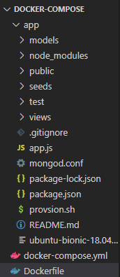
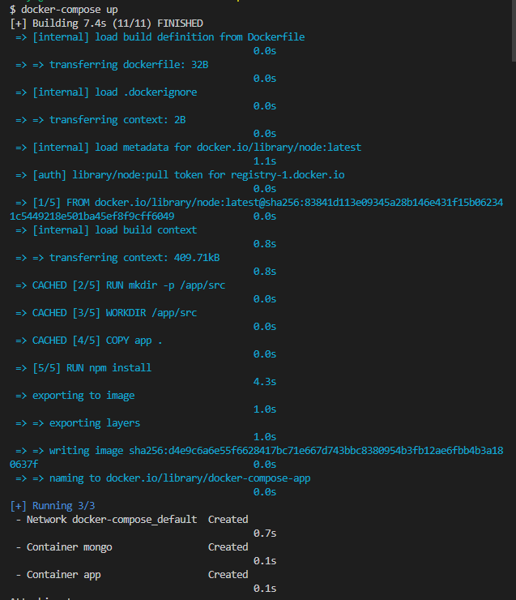
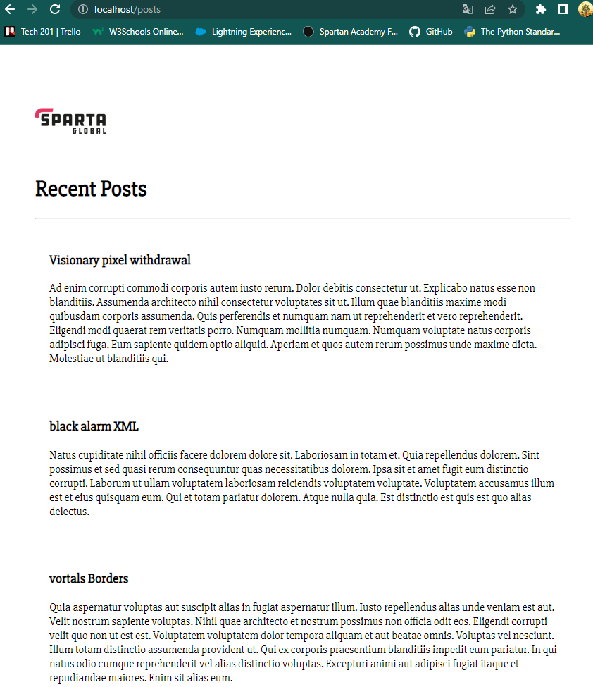

# docker-compose

Docker Compose is a tool used to define and run multi-container docker applications. It allows you to define a group of containers that work together to form a complete application, and then start and stop all of the containers in the group with a single command. 

## Deployment of Node app and MongoDB database

For this task we will need to create a `docker-compose.yml` file that will be written in YAML language. 

We will need a Dockerfile that contains the script to run our app. 

```Docker
FROM node:latest
RUN mkdir -p /app/src
WORKDIR /app/src
COPY app .
RUN npm install
EXPOSE 3000
CMD ["npm","start"]
```

The folder structure is very important with this task and it needs to be as follows: 



**NOTE** that the we migrated our app folder with all the packages and scripts for the app. 

Next we need to configure the `docker-compose.yml` that we created. 

```YAML
version: "3"
services: 
  mongo:
    image: mongo:4.4
    container_name: mongo

    volumes:
     - ./app/mongod.conf:/etc/mongod.conf

    ports:
    - "27017:27017"


  app:
    container_name: app
    restart: always
    build: .
    ports:
      - "80:3000"
    links:
     - mongo
    environment:
    - DB_HOST=mongodb://mongo:27017/posts
```

Let's break this code down:

1. `version: "3"` : This line specifies the version of the Docker Compose file format being used. In this case, it's version 3.

2. This block defines the mongo service.
It uses the official mongo:4.4 Docker image as the base image for the container.
It sets the name of the container to mongo.
```YAML
services: 
  mongo:
    image: mongo:4.4
    container_name: mongo
``` 

3. This line specifies a volume to be mounted in the mongo container.
It maps the local file ./app/mongod.conf to the container path /etc/mongod.conf.
```YAML
    volumes:
     - ./app/mongod.conf:/etc/mongod.conf
```

4. This line specifies that the container's port 27017 should be mapped to the host machine's port 27017.
```YAML
    ports:
    - "27017:27017"
```

5. 
```YAML
  app:
    container_name: app
    restart: always
    build: .
    ports:
      - "80:3000"
    links:
     - mongo
    environment:
    - DB_HOST=mongodb://mongo:27017/posts
```

And lastly, this block defines the app service.
It sets the name of the container to app.
It specifies that the container should always be restarted if it fails.
It builds the Docker image for the application using the local Dockerfile (build: .).
It maps the container's port 3000 to the host machine's port 80.
It links the mongo service to this service so that the mongo container can be accessed by this service.
It sets the DB_HOST environment variable to mongodb://mongo:27017/posts.


---

When we have configured the `docker-compose` file we can open our terminal in VS code and run `docker-compose up` to start the Docker Compose application and read the file. 


**OUTPUT**:



Now to have our app display the posts, we need to first open GitBash terminal, navigate to the same directory and run `alias docker="winpty docker"` which is a command that helps to make Docker work properly with Git Bash or other Unix-style shells in a Windows environment.

Next we need to enter the app container using `docker exec -it "CONTAINER ID" sh`. Once we are prompted into the interactive shell we run `npm install` and `node seeds/seed.js` to populate the app with the data. 

To check the functionality, we open our browser and type in `localhost/posts` and this should be the output:



